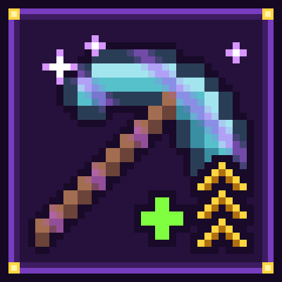

<p align="center">
  
</p>

<h1 align="center">Enchantaholic</h1>

<p align="center"><em>Break a block. Get enchanted. Never stop.</em></p>

Enchantaholic is a Minecraft mode in which each block you break adds a random enchantment to a random item in your
inventory. Levels keep stacking past the vanilla caps.

It comes in two versions:

- **Java Edition:** a Fabric mod for Minecraft 26.2–26.3 (in [`fabric/`](fabric/))
- **Bedrock Edition:** a behavior pack (in [`bedrock/`](bedrock/), see [bedrock/README.md](bedrock/README.md))

## What it does

When the mode is on, each block a player breaks does the following:

1. **Skipped cases:** players in Creative or Spectator, and blocks that break instantly (hardness 0: grass, flowers,
   torches and so on).
2. **Item:** one random non-empty slot, from the main inventory (hotbar included), the armor slots and the offhand.
3. **Enchantment:** a random enchantment from the whole registry, curses included (plus Enchantaholic's own when
   [custom enchantments](#custom-enchantments-optional-off-by-default) are on). `Lunge` is only ever given to
   spears. If no enchantment fits the chosen item, another item is picked, and if none is left nothing happens.
4. **Level:** if the item already has that enchantment, its level goes up by 1. Otherwise the enchantment is added at
   level I.
5. **Feedback:** the actionbar shows the item and its new level, for example `✦ Diamond Pickaxe → Efficiency VI`.
   Each player can turn off the sound, the message, or both (see [Notification settings](#notification-settings)).

Difficulty and hardcore settings are never changed. Levels beyond X are shown as Roman numerals (XI, XII and so on).

## Java vs Bedrock

| | Java (Fabric) | Bedrock (behavior pack) |
|---|---|---|
| Game versions | Minecraft Java 26.2–26.3 | Bedrock 26.50+ |
| Turning it on | **Enchantaholic Mode** ON/OFF button on the Create World → Game tab (saved with the world), or `/enchantaholic on` | Activate the behavior pack when you create the world |
| Default | Off | On while the pack is active |
| Toggling later | `/enchantaholic [on\|off\|status]`, operators only (permission level 2, like /gamerule) | `/enchantaholic:toggle [on\|off\|status]`, operators only (works with cheats off) |
| Enchantment/item pairs | Any enchantment on any item (compatibility is not checked) | Only pairs Bedrock accepts: an incompatible pick is rerolled (another enchantment or another item) |
| Level cap | 255 (Java's hard limit) | No cap on the tracked level. The **real** enchantment stops at the vanilla max, and the true level is kept in a lore line and a dynamic property on the item |
| Levels above the vanilla max | Real enchantment levels, so vanilla formulas apply at every level (see [Known quirks](#known-quirks-java)) | Extra bonus effects only for Sharpness, Smite, Bane of Arthropods, Power, the Protection family (Protection, Fire/Blast/Projectile Protection, Feather Falling) and Efficiency. Other enchantments show the level only |
| Custom enchantments (off by default) | **Custom Enchantments** ON/OFF button on the Create World → Game tab, or `/enchantaholic custom [on\|off\|status]` (operators). Real enchantments, up to level 255 | `/enchantaholic:custom <on\|off\|status>` (operators, works with cheats off). Stored in lore, no level cap. Lower safety caps (see [Custom enchantments](#custom-enchantments-optional-off-by-default)) |
| Achievements | Unaffected | Disabled in the world, because Minecraft disables them for any behavior pack |
| Notification settings (per player) | Mod Menu → Enchantaholic → config screen, or the client command `/enchantaholic-notify <sound\|message\|status> [on\|off]` (needs the mod on the client; saved in `config/enchantaholic.json`) | `/enchantaholic:notify <sound\|message\|status> [on\|off]`, any player, works with cheats off |

## Notification settings

Every enchant shows an actionbar message and plays a quiet chime. Each player can turn off either one, or both:

- **Java:** with [Mod Menu](https://modrinth.com/mod/modmenu) installed, open Mods → Enchantaholic → the config
  button, and switch **Enchant sound** / **Enchant message**. Without Mod Menu, use the client command
  `/enchantaholic-notify sound off`, `/enchantaholic-notify message off`, or `/enchantaholic-notify status`.
  Settings are stored on your computer in `config/enchantaholic.json` and apply on any server that runs
  Enchantaholic. Players who join without the mod on their client always get the default message and sound.
- **Bedrock:** `/enchantaholic:notify sound off`, `/enchantaholic:notify message off`,
  `/enchantaholic:notify status`. No operator rights or cheats are needed, and the settings are saved with your
  player in that world.

## Custom enchantments (optional, off by default)

Want more chaos? Enchantaholic ships 11 enchantments of its own, including two curses. They're **off by default**.
Turn them on and they join the random rolls alongside vanilla enchantments, and they can land on **any** item.
Yes, a stick with Barrage. Levels stack past I just like everything else in Enchantaholic.

**Turning them on** (saved per world)
- **Java:** Create World → *Game* tab → **Custom Enchantments: ON** (under *Enchantaholic Mode*), or as an operator:
  `/enchantaholic custom on|off|status` (plain `/enchantaholic custom` shows the status).
- **Bedrock:** as an operator: `/enchantaholic:custom on|off|status` (works with cheats off).

Enchantaholic Mode has to be on too, because custom enchantments arrive through the same block-break rolls.
If you turn customs off, nothing new gets rolled and existing custom enchantments go dormant (they do nothing).
Items keep them, and they wake up again when you turn customs back on.

"Held" means the main hand, except for Barrage and Kaboom, which read the bow, crossbow, trident or thrown item
itself (in either hand), and Magnet, which also works from the off hand.

| Enchantment | Works when | Effect at level L | Safety cap |
|---|---|---|---|
| Vein Miner | held, breaking a block | Also breaks up to 8×L connected blocks (diagonals count) of the same type, using durability | Java 1024 blocks (64 per tick), Bedrock 256 (32 per tick) |
| Barrage | shooting or throwing | Fires 10×L extra copies with random spread. Copies can't be picked up | Java 512 per shot, Bedrock 64 per shot |
| Yeet | held, melee hit | Launches the target up and away, harder at higher levels | Launch speed capped |
| Kaboom | projectiles you fire | Explode on impact with power 1 + 0.5×L. No block damage, no fire | Power 8 |
| Party Popper | held, killing a mob | L harmless fireworks plus confetti | 16 fireworks |
| Chicken Rain | held, breaking a block | 5×L % chance to spawn a chicken (sometimes a baby) | 100 %, 1 chicken per block |
| Midas Touch | held, breaking a block | 3×L % chance to drop a gold nugget. From level 34, some of those drops are gold ingots | 100 % |
| Magnet | held or worn | Pulls item drops and XP orbs within 3 + L blocks toward you, every half second | 24-block radius |
| Moon Boots | worn (any armor slot) | Jump Boost L and no fall damage | Jump Boost XI |
| Curse of Butterfingers | held | 2×L % chance per hit or block break to drop the held item | 50 % |
| Curse of Hiccups | anywhere in your inventory | Every 10 s, 3×L % chance of an involuntary hop, with a *hic!* | 60 % |

**Fair play:** blocks broken and mobs spawned by these effects never trigger new Enchantaholic rolls.
Explosions never break blocks (but they can hurt you). Barrage copies can't be picked up, so there's no duping.
Ender pearls and bottles o' enchanting are never copied.

**Edition differences**

| | Java | Bedrock |
|---|---|---|
| Where the level lives | Real enchantments (`enchantaholic:vein_miner` …), shown in tooltips like any other and compatible with description mods such as Enchantment Descriptions. Not on enchanting tables, in loot or from villagers, only through Enchantaholic rolls (or `/enchant`). Up to level 255 | A blue lore line such as `Vein Miner III` (curses are red), plus an item dynamic property on non-stacking items. No level cap, but every effect keeps its safety cap |
| Vein Miner drops | Normal survival breaking: Fortune, Silk Touch and tool tier apply | Broken as if by hand: no Fortune or Silk Touch (glass and ice drop nothing), no tool-tier check, no ore XP. At most 8 veins at once |
| Barrage | Bows, crossbows, tridents, snowballs, eggs, wind charges, splash and lingering potions. Trident copies lose Loyalty | Bows, crossbows, snowballs, eggs, wind charges (no tridents: the game won't let a script spawn them). Copies are removed on impact or after 10 s; at most 1024 exist at once |
| Kaboom | Explosions spare item drops, XP orbs and projectiles. At most 64 explosions per tick and 20 ms of explosion work per tick; later impacts that tick fizzle | At most 16 explosions per tick. The projectile is removed after exploding (a real trident is kept). Explosions can damage item drops, armor stands and item frames |
| Magnet | At most 256 entities pulled per player per pulse | At most 64 entities per player per pulse |
| Chicken Rain | No extra limit | No chicken when 32 are already within 16 blocks |
| Yeet, Hiccups on players | Launch speed set directly | Uses knockback, so knockback resistance weakens Yeet |

## Install

### Java Edition

1. Install [Fabric Loader](https://fabricmc.net/use/) for Minecraft 26.2 or 26.3, and run the game on Java 25.
2. Put [Fabric API](https://modrinth.com/mod/fabric-api) and `enchantaholic-<version>.jar` in your `mods/` folder. Get
   the jar from [GitHub releases](https://github.com/nezo32/enchantaholic/releases) or CurseForge.
   Optional: [Mod Menu](https://modrinth.com/mod/modmenu) for the settings screen.
3. Turn the mode on in one of two ways:
   - **New world:** Create World → Game tab → set **Enchantaholic Mode** to **ON**.
   - **Existing world or dedicated server:** an operator runs `/enchantaholic on` (`/enchantaholic status` shows the
     current state). It is off by default. In single-player this needs cheats: Allow Commands on, or Open to LAN with
     Allow Cheats on.
4. Optional: turn on [custom enchantments](#custom-enchantments-optional-off-by-default) with the **Custom
   Enchantments** button or `/enchantaholic custom on`.

**Upgrading from 0.1.0:** 0.1.0 used a game rule (`enchantaholic:enchantaholic`) instead. Worlds that had it on are
switched ON automatically the first time they load with 0.2.0. That first load logs one harmless
`Unknown registry key … enchantaholic:enchantaholic` error; the other game rules are kept, and the stale entry is
dropped on the next save.

### Bedrock Edition

1. Download `enchantaholic-<version>.mcaddon` from [GitHub releases](https://github.com/nezo32/enchantaholic/releases)
   or CurseForge, then open it to import it into Minecraft.
2. Create a world and activate **Enchantaholic** under **Behavior Packs**.
3. Optional: operators can use `/enchantaholic:toggle off` / `on` / `status`, and turn on
   [custom enchantments](#custom-enchantments-optional-off-by-default) with `/enchantaholic:custom on`.

Details and limitations: [bedrock/README.md](bedrock/README.md).

## Known quirks (Java)

The Java mod doesn't change how vanilla handles very high levels. Some examples:

- Enchanted stacks no longer merge with plain ones (enchanted dirt vs. dirt). The whole stack is enchanted at once.
- Efficiency, Sharpness, Power, Unbreaking, Fortune and Looting scale up to extreme values. High Efficiency breaks
  almost every block instantly.
- The Protection family stops helping at vanilla's cap of 80% damage reduction.
- Knockback, Punch, Riptide and Wind Burst can launch entities (and you) very far.
- Very high Multishot fires hundreds of projectiles, and very high Frost Walker freezes a huge area. Both can cause lag.
- Some enchantments (Mending, Infinity, Silk Touch and similar) gain nothing from levels above I.

## Repository layout

| Path | Contents |
|---|---|
| `fabric/` | Java Edition Fabric mod (Gradle) |
| `bedrock/` | Bedrock behavior pack (TypeScript, esbuild, vitest) |
| `.github/workflows/` | CI (`ci.yml`), release (`release.yml`) and the reusable `reusable-*.yml` workflows |
| `scripts/` | CurseForge upload script and its tests |
| `docs/ci/` | Release runbook and reusable pipeline docs |
| `docs/branding/` | Logo, palette, player-facing strings |

## Development

The **Java mod** needs JDK 25. Gradle can also run on Java 21 and download a JDK 25 toolchain.

```bash
cd fabric
./gradlew build          # Minecraft 26.3: compile, JUnit, server GameTests; jars in build/libs/
./gradlew clean build -Pmc=26.2   # the same against 26.2
```

One jar runs on both 26.2 and 26.3. The Create World toggle is covered by a client GameTest (`./gradlew
runClientGameTest`). It needs a display (for example Xvfb), so `build` and CI don't run it.

The **Bedrock pack** needs Node 22+ (CI uses 24).

```bash
cd bedrock
npm ci
npm run typecheck && npm run lint && npm test
npm run package          # dist/enchantaholic-<version>.mcaddon and .mcpack
```

The in-game checks for Bedrock are listed in
[bedrock/README.md → Manual in-game checklist](bedrock/README.md#manual-in-game-checklist).

Branch names, PR rules and the full list of local checks are in [CONTRIBUTING.md](CONTRIBUTING.md).

## Releasing

To release, push an annotated `vX.Y.Z` tag on a commit of `main` (pre-releases use `-alpha.N`, `-beta.N` or `-rc.N`).
`release.yml` then does the rest:

1. Builds and tests the jar and the `.mcaddon`, stamping the tag's version into them.
2. Creates the GitHub release with notes generated from PR titles and labels.
3. Uploads the files to CurseForge.

Don't edit the versions in `fabric/gradle.properties` or `bedrock/**/manifest.json` by hand. The tag sets the version.

- Maintainer runbook: [docs/ci/RELEASING.md](docs/ci/RELEASING.md)
- How the reusable pipeline works and how other projects can use it:
  [docs/ci/REUSABLE_RELEASE_PIPELINE.md](docs/ci/REUSABLE_RELEASE_PIPELINE.md)

## License

[MIT](LICENSE) © 2026 nezo
